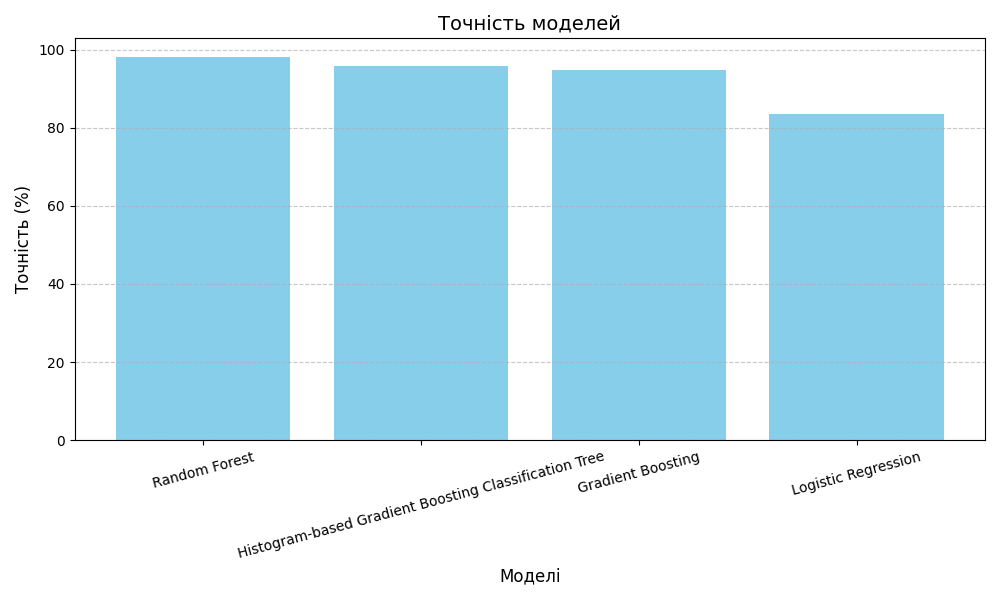
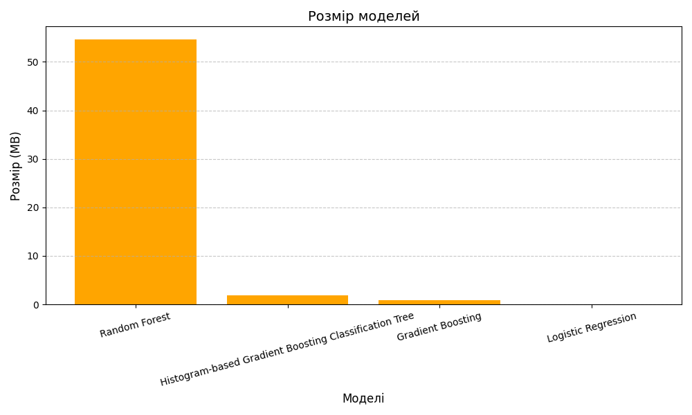
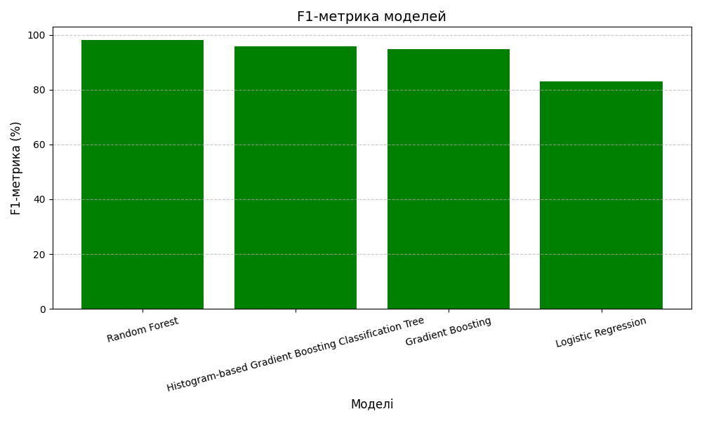

---

# **Система прогнозування відтоку клієнтів**

## **Зміст**
1. [Опис проєкту](#опис-проєкту)
2. [Ключові результати моделі](#ключові-результати-моделі)
3. [Основні функції](#основні-функції)
4. [Структура проєкту](#структура-проєкту)
5. [Архітектура системи](#архітектура-системи)
6. [Інструкція для запуску](#інструкція-для-запуску)
7. [Приклади використання](#приклади-використання)
8. [Ролі команди](#ролі-команди)
9. [Використані інструменти](#використані-інструменти)
10. [Ліцензія](#ліцензія)
11. [Додаткова інформація](#Додаткова інформація)
---

## **Опис проєкту**
Відток клієнтів — це одна з найбільших проблем телекомунікаційних компаній. Наш проєкт надає компаніям інструмент для прогнозування відтоку клієнтів, що дозволяє заздалегідь вживати заходів для їхнього утримання.

Ця система:
- Аналізує дані про клієнтів.
- Прогнозує ймовірність їхнього відтоку.
- Надає ключові метрики, які допомагають у прийнятті бізнес-рішень.

Мета: 
**зменшення відтоку клієнтів на основі точного аналізу їхньої поведінки та характеристик**.

---

## **Ключові результати моделі**
### **Точність моделей на тестових даних**
- **Histogram-based Gradient Boosting Classification Tree (HGBClassifier):** 94%
- **Random Forest:** 94%
- **Gradient Boosting:** 94%
- **Logistic Regression:** 84%

> **Коментарі:**
> - Моделі `Random Forest`, `HGBClassifier` та `Gradient Boosting` демонструють однакову метрику **accuracy**.
> - Модель `Logistic Regression` має відчутно меншу точність, але залишається прийнятною для багатьох задач.

### **Точність моделей на усіх даних**
- **Random Forest:** 98%
- **Histogram-based Gradient Boosting Classification Tree (HGBClassifier):** 96%
- **Gradient Boosting:** 95%
- **Logistic Regression:** 83%

> **Коментарі:**
> - На усіх даних найвищу точність показує `Random Forest` (98%).
> - Модель `HGBClassifier` трохи поступається `Random Forest`, але її розмір значно менший.

### **Розмір моделей**
- **Logistic Regression:** 1.41 kB (найменша модель)
- **Gradient Boosting:** 0.88 MB
- **Histogram-based Gradient Boosting Classification Tree (HGBClassifier):** 1.88 MB
- **Random Forest:** 54.55 MB (найбільша модель)

> **Коментарі:**
> - Модель `Random Forest` є найбільш об'ємною (54.55 MB), тоді як `Logistic Regression` займає мінімальну кількість пам'яті (1.41 kB).
> - Моделі `Gradient Boosting` і `HGBClassifier` мають прийнятний розмір та не

### Вихідні графіки:
1. **Порівняння точності моделей**:
   - 
2. **Розмір моделей**:
   - 
3. **Розмір моделей**:
   - 


---

## **Підсумки**

- **Найточнішою є модель Random Forest**: висока точність, але великий розмір.
- **Модель Histogram-based Gradient Boosting Classification Tree (HGBClassifier)**:
  - Баланс між точністю та розміром.
  - Оптимальний вибір для задачі, де потрібна висока продуктивність із невеликим розміром моделі.
- **Gradient Boosting**:
  - Близька до HGBClassifier, але менш ефективна.
- **Logistic Regression**:
  - Найменший розмір, але нижча точність. Підходить для задач, де пам’ять є критичним обмеженням.

---

## **Рекомендації**

1. **Обрати `HGBClassifier`, якщо необхідно досягти балансу між точністю та продуктивністю.**
2. **Використовувати `Random Forest`, якщо критично важлива максимальна точність.**
3. **Використовувати `Logistic Regression`, якщо пам'ять або обчислювальні ресурси є обмеженням.**

---

## **Основні функції**

1. **Прогнозування відтоку клієнтів**: Введення характеристик клієнта та отримання ймовірності відтоку.
2. **Інтерактивний інтерфейс**: Простий і зрозумілий веб-додаток на основі `Dash`.
3. **Аналіз метрик моделі**: Графіки метрик точності, повноти та F1 Score.
4. **Генерація випадкових даних**: Для тестування системи.
5. **Контейнеризація**: Весь проєкт легко запускати через Docker.

---

## **Структура проєкту**

```
.
├── data
│   ├── processed
│   │   ├── medians.json
│   │   ├── processed_data.csv
│   │   └── scaler.pkl
│   ├── raw
│   │   └── internet_service_churn.csv
│   └── README.md
├── docker
│   ├── docker-compose.yml
│   ├── dockerfile
│   └── README.md
├── models
│   ├── model_GradientBoosting.joblib
│   ├── model_HistGradientBoosting.joblib
│   ├── model_LogisticRegression.joblib
│   └── model_RandomForest.joblib
├── nixpacks.toml
├── notebooks
│   ├── 01_Analyze_EDA.ipynb
│   ├── 02_preprocessing.ipynb
│   ├── 03_model_training.ipynb
│   ├── 04_evaluation.ipynb
│   └── README.md
├── poetry.lock
├── pyproject.toml
├── README.md
├── requirements.txt
├── results
│   ├── accuracy_comparison.png
│   ├── f1_score_comparison.png
│   ├── model_evaluation.json
│   └── model_size_comparison.png
└── src
    ├── data_preparation.py
    ├── evaluation.py
    ├── faker_new_client.py
    ├── graph_processing.py
    ├── __init__.py
    ├── model_training.py
    └── README.md

```

---

## **Архітектура системи**

1. **Frontend:**
   - `Dash` для створення веб-інтерфейсу.
   - `Bootstrap` для стилізації.

2. **Backend:**
   - Моделі машинного навчання (`RandomForest`, `LogisticRegression`).
   - Функції для обробки даних та прогнозування.

3. **Дані:**
   - Сирі дані зібрані з телекомунікаційної компанії.
   - Попередньо оброблені дані з використанням `Pandas`, `Scikit-learn`.

4. **Контейнеризація:**
   - Використовується `Docker` для забезпечення відтворюваності середовища.
   - 
5. **Deploy:**
   - Використовується `Koyeb` для разгортання Web-додатка.
---

## **Інструкція для запуску**

### **1. Клонування репозиторію**
```bash
git clone https://github.com/your-repo/Customer_Outflow.git
cd Customer_Outflow
```

### **2. Встановлення залежностей**
**Через pip:**
```bash
pip install -r requirements.txt
```

**Або через Poetry:**
```bash
poetry install
```

### **3. Запуск додатку**
```bash
python src/evaluation.py
```

Відкрийте [http://127.0.0.1:8050](http://127.0.0.1:8050) або [http://0.0.0.0:8050/] (http://0.0.0.0:8050/) у браузері.

### **4. Використання Docker (опціонально)**
```bash
docker-compose up
```

---

## **Приклади використання**

1. **Прогнозування:**
   - Заповніть форму на основі даних клієнта.
   - Натисніть "Зробити прогноз".
   - Отримайте результати (рівень ризику, ймовірність відтоку).

2. **Генерація даних:**
   - Натисніть "Випадкові дані", щоб автоматично заповнити форму.

3. **Перегляд метрик:**
   - Під графіком результатів доступні метрики точності моделі.

---

## **Ролі команди**

- **Maryna Dudik - Team Lead**: Організація роботи, документація.
- **Heorhii Kaplytskyi - Scrum-master**: Організація роботи, документація.
- **Gleb - Data Analyst**: Аналіз даних.
- **Gleb - Data Engineer**: Підготовка даних.
- **Liana Lotarets - Data Scientist**: Навчання моделей.
- **Inna Bogutska - Backend Developer**: Реалізація інтерфейсу.
- **Maryna Dudik - DevOps-інженер**: Контейнеризація.

---

## **Використані інструменти**

- **EDA**: `Pandas`, `Matplotlib`, `Seaborn`.
- **Моделі**: `Scikit-learn`, `XGBoost`.
- **Веб-інтерфейс**: `Dash`, `Plotly`, `Bootstrap`.
- **Контейнеризація**: `Docker`.
- **Deploy**: `Koyeb`.
---

## **Ліцензія**

Цей проєкт розповсюджується під ліцензією MIT.

---
## **Додаткова інформація**

Це навчальний проєкт в рамках курса **PYTHON DATA SCIENCE AND MACHINE LEARNING**  від **GOIT**.
З розробленим додатком можна ознайомитись за посиланням: [customeroutflow](https://soft-kristal-customeroutflow-a66dd928.koyeb.app/#footer)